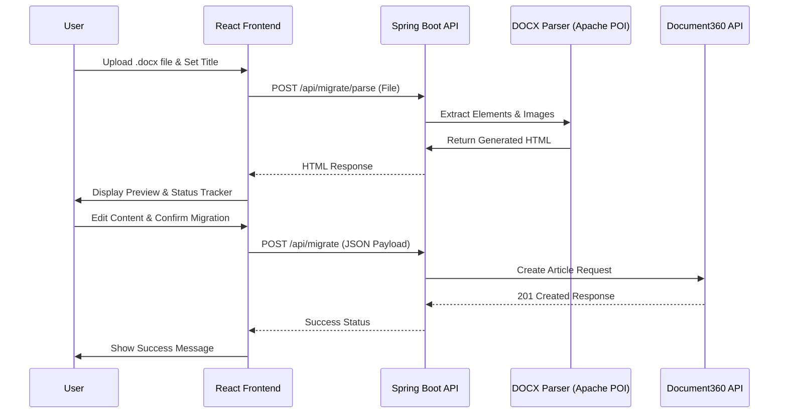

# 🚀 Document Migration Tool

A premium full-stack application built with **React.js** and **Spring Boot** to automate the migration of Microsoft Word documents (`.docx`) to **Document360** articles with high fidelity.

---

## ✨ Features
- **🧠 Intelligent Parsing**: Extracts headings, paragraphs, bullet/numbered lists, and complex tables using Apache POI.
- **🖼️ Image Extraction**: Automatically extracts embedded images from Word docs and embeds them as Base64 in the HTML content.
- **✍️ Inline Rich Text Editor**: Edit and polish the parsed HTML content directly in the browser using an integrated editor before migrating.
- **📂 Dynamic Category Selection**: Fetch and select target categories directly from your Document360 project.
- **📊 Real-time Status Tracking**: Visual progress tracker with checkpoints (Uploading, Parsing, API Communication) to keep you informed.
- **📄 Live Preview**: Preview the generated HTML content and formatting with realistic rendering.
- **💾 Local Download**: Option to download the clean HTML file locally to your machine.
- **🔄 Multi-Step Workflow**: Interactive 3-step UI (Upload -> Preview -> Confirm) powered by **Framer Motion**.
- **🔍 Swagger Documentation**: Built-in API documentation and sandbox for testing endpoints.
- **🎨 Premium UI**: Modern glassmorphism design with responsive elements and scanning animations.

---

## 📊 Migration Flow


---

## 🛠️ Tech Stack

### Frontend
- **React 18** (Vite)
- **React Quill** (Inline rich text editing)
- **Framer Motion** (Smooth transitions and animations)
- **Lucide React** (Vector icons)
- **Axios** (API communication)

### Backend
- **Spring Boot 3.x** (Java 17+)
- **Apache POI 5.2.3** (Word document processing)
- **SpringDoc OpenAPI** (Swagger/OpenAPI documentation)
- **Lombok** (Boilerplate reduction)
- **JUnit 5 & Mockito** (Testing framework)

---

## 🚀 Getting Started

### 1. Prerequisites
- **Java 17** or higher
- **Node.js 18** or higher
- **Maven 3.6+**
- A **Document360 API Token** and **Project ID**

### 2. Configuration
Update the `backend/src/main/resources/application.properties` file:
```properties
document360.api.key=YOUR_API_TOKEN
document360.project.id=YOUR_PROJECT_ID
```

### 3. Run the Backend
```bash
cd backend
./mvnw spring-boot:run
```
- **Base URL**: `http://localhost:8080`
- **Swagger UI**: `http://localhost:8080/swagger-ui.html`

### 4. Run Tests (Optional)
```bash
cd backend
./mvnw test
```

### 5. Run the Frontend
```bash
cd frontend
npm install
npm run dev
```
- **URL**: `http://localhost:5173`

---

## 📂 Project Architecture

### Backend (`/backend`)
- **`DocxParser.java`**: Critical logic for parsing Word elements and handling image-to-Base64 conversion.
- **`Document360Client.java`**: Service to interact with Document360 Articles and Categories APIs.
- **`MigrationController.java`**: REST Controller providing validated endpoints for parsing and migration.
- **`MigrationRequest.java`**: DTO for handling structured JSON payloads.

### Frontend (`/frontend`)
- **`FileUpload.jsx`**: Core interactive component managing file uploads, status tracking, and the editor.
- **`App.jsx`**: Main layout container with global styles and responsive header.

---

## 🛡️ Error Handling & Validation
The application includes multi-layered validation:
- **✅ File Validation**: Strict checks for `.docx` format.
- **⚖️ Size Limits**: Enforced 10MB file size limit.
- **🧱 API Resilience**: Specific handling for Document360 API failures (401, 403, 500).
- **🛡️ Quality Assurance**: Comprehensive suite of JUnit 5 and Mockito tests.

---

## 🔄 Workflow
1. **Upload**: Enter an article title and upload your `.docx` file.
2. **Preview & Edit**: View the parsed content and use the inline editor for final adjustments.
3. **Action**:
    - Click **Download** to save HTML locally.
    - Click **Migrate to Document360** for API upload.
4. **Success**: Receive instant confirmation from the API.

---

## 🛡️ License
Distributed under the MIT License.
